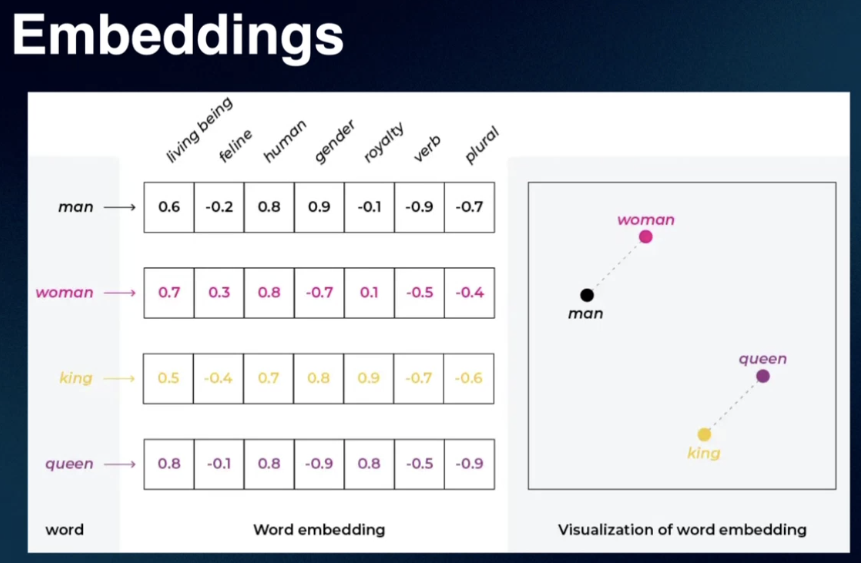
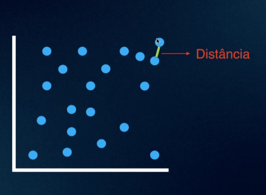
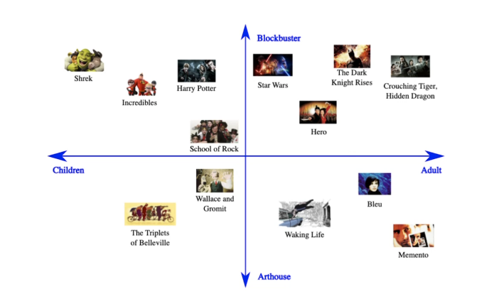

# Aula 1: Criando aplicações baseadas em LLMs

Data: 13/06/2024

- Como representar texto?
  - Contagem de palavras
  - TF-IDF

- Como funciona os embeddings?

- **Pontos: dimensões dos produtos**

- Os embeddings vão ser os documentos que ajudarão os usuários a terem melhores respostas
- Procuram os chunks mais próximos
- Embeddings são modelos que transformam um dado qualquer em numérico
- São pré-treinados em conjuntos de dados massivos
- O modelo aprende a quantidade de dimensões
- Pegar os chunks e transformar em embeddings