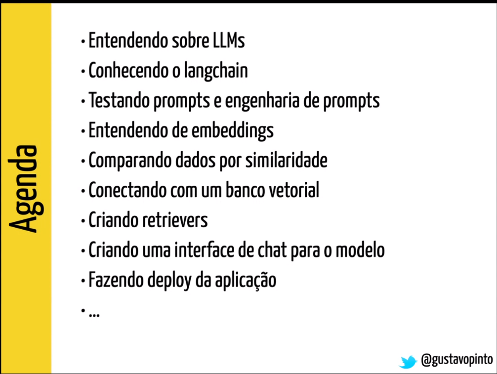

# Aula 1: Criando aplicações baseadas em LLMs

Data: 04/06/2024

## O que são LLMs?

- Artificial Intelligence > Machine Learning > Generative AI

- O que é um modelo?
    - Chute baseado em dados
    - Chute baseado em histórico

- No contexto clássico de machine learning, queremos prever um evento/outcome

- No contexto de LLM/GenAI queremos prever uma próxima palavra, dado o contexto
    - Chutar o próximo token/palavra/caracter

- Generative AI > Foundation models > LLMs > Transformers

- Agente conversacional: onde o modelo é "ensinado" a ter um perfil.

- Modelos foundations geram os tokens infinitamente. Diferente de um modelo com fine-tunning, que é específico para um objetivo

- Foundation Models: escopo mais amplo

- LLMs: Focados exclusivamente em texto e tarefas de NLP. 

### **Transformers**: arquitetura

- Modelos linguísticos -> O objetivo inicial era de tradução de línguas

> TO-DO: Ler o artigo *Attention is all your need*

- Encoders e Decoders

- Múltiplos encoders, não somente um 

> TO-DO: Ver o artigo do jallamar e o vídeo

## Exercício: 

- O que é um modelo linguístico?

Um modelo linguístico é um modelo de inteligência artificial onde os dados utilizados para o treinamento são textos e, consequentemente, também geram como saída textos. 

- Descreva brevemente uma aplicação que você poderia construir usando um modelo linguístico? 

Chatbot. Onde os dados de treinamento são todas as documentações que temos dentro da empresa e o usuário pergunta determinadas informações que estão dentro dessa documentação.

- Descreva brevemente uma aplicação que você não poderia construir usando um modelo linguístico?

Previsão de demanda de produtos de um e-commerce. Onde os dados treinados são tabulares e as features/variáveis explicativas são características dos produtos ou localização.
